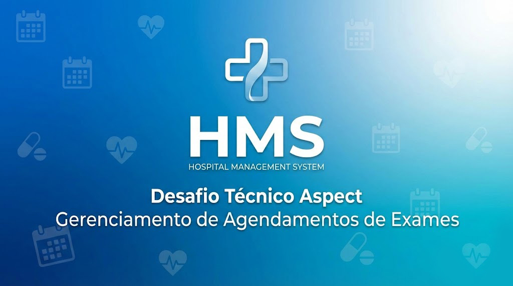

# 🏥 Hospital Management System - Desafio Técnico Aspect

Este projeto é uma aplicação Full Stack desenvolvida para gerenciar agendamentos de exames hospitalares. A solução permite que usuários visualizem exames disponíveis, realizem novos agendamentos e gerenciem a lista de procedimentos marcados.


> HMS - Gerenciamento total de hospitais

___

## Índice

* [Tecnologias](#tecnologias)
* [Requisitos](#requisitos)
* [Execução](#execução)
* [Estrutura](#estrutura)
* [API](#api)
* [Diferenciais](#diferenciais)
* [Licença](#licença)
* [Links](#links)

## Tecnologias

### Frontend

* **React.js** com **TypeScript**
* **Context API** para gerenciamento de estado global
* **Axios** para consumo de API RESTful
* **CSS Modules** para estilização

### Backend

* **Node.js** com **TypeScript**
* **Express.js** como framework web
* **TypeORM** como ORM para interação com o banco de dados
* **MySQL 8.0** como banco de dados relacional

### Infraestrutura

* **Docker** e **Docker Compose** para orquestração de containers

---

## Requisitos

* [x] **Visualizar Exames Disponíveis:** Listagem de tipos de exames com Nome e Especialidade Médica.
* [x] **Adicionar Agendamento:** Formulário para marcar exames selecionando tipo, data/hora e observações.
* [x] **Visualizar Agendamentos:** Dashboard com a lista de todos os exames agendados.
* [x] **Excluir Agendamento:** Funcionalidade para remover agendamentos existentes.

---

## Execução

A forma mais simples de rodar a aplicação é utilizando o **Docker Compose**, que configurará automaticamente o banco de dados, o backend e o frontend.

### Pré-requisitos

* Docker instalado
* Docker Compose instalado

### Passo a Passo

1. **Clone o repositório:**
```bash
git clone https://github.com/jonnypaes/rascunho_hospital.git
cd rascunho_hospital

```


2. **Suba os containers:**
```bash
docker-compose up --build

```


3. **Acesse as aplicações:**
* **Browser:** [http://localhost:5173](http://localhost:5173)
* **API:** [http://localhost:3000/exams](http://localhost:3000/exams) - [http://localhost:3000/appointments](http://localhost:3000/appointments) ([http://localhost:3000](http://localhost:3000))
* **Database:** [http://localhost:3306](http://localhost:3306)


> **Nota:** O banco de dados será populado automaticamente com alguns exames iniciais (Hematologia, Cardiologia, etc.) através de um script de *Seed* durante a inicialização do backend.

---

## Estrutura

```text
├───backend
│   ├───src
│   │   ├───database        # Conexão e Migrations/Seeds 
│   │   │   └───seeds
│   │   ├───controllers     # Lógica de recebimento de requisições
│   │   ├───services        # Chamadas de API com Axios
│   │   ├───middlewares     # Tratamento de dados
│   │   ├───views           # Tratamento de interação
│   │   └───entities        # Modelagem do banco de dados (TypeORM)
├───frontend
│   ├───src                 # Código de interação
│   └───static              # Arquivos estáticos
│       ├───icons
│       ├───screenshots
│       └───wallpapers
├───initdb                  # Criação de estrutura de Banco de dados
├───files                   # Arquivos relacionados

```

---

## API

Abaixo estão os principais endpoints da aplicação:

### Exames

* `GET /exams`: Retorna a lista de todos os tipos de exames disponíveis para agendamento.

### Agendamentos

* `GET /appointments`: Retorna todos os agendamentos realizados.
* `POST /appointments`: Cria um novo agendamento.
* **Body esperado:** `{ "examId": number, "date": "YYYY-MM-DD HH:mm", "notes": string }`


* `DELETE /appointments/:id`: Remove um agendamento específico.

---


## Diferenciais

* **Docker Mini** Instância do docker altamente parametrizada para rapidez em uso e testes unitários
* **Tipagem Estrita:** Uso rigoroso de TypeScript em ambas as camadas para evitar erros em tempo de execução.
* **Docker Ready:** Deploy facilitado via containers.
* **Integridade de Dados:** Relacionamentos `ManyToOne` e `OneToMany` configurados para garantir a consistência entre Exames e Agendamentos.

## Licença

O software é licenciado com licença MIT e permite o uso comercial e não comercial do software, alteração e distribuição livre. 

Para mais informações, leia o arquivo de [licença](LICENSE.txt)

## Links
[Github](https://github.com/jonnypaes/rascunho_hospital) | [Github Sites](https://jonnypaes.github.io/rascunho_hospital) | [Railway](https://frontend-production-c5fc.up.railway.app)
